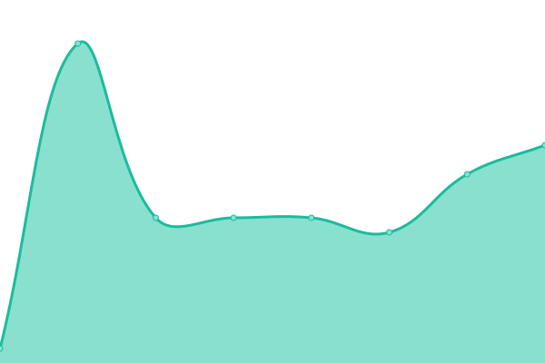
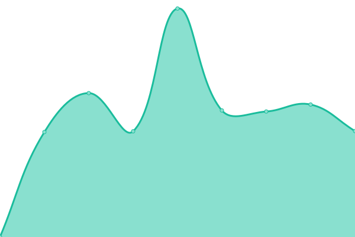

# [📈 Estado Actual](https://udweb.la-razon.com): <!--live status--> **🟧 Interrupción parcial**

This repository contains the open-source uptime monitor and status page for [La Razón](www.la-razon.com), powered by [Upptime](https://github.com/upptime/upptime).

With [Upptime](https://upptime.js.org), you can get your own unlimited and free uptime monitor and status page, powered entirely by a GitHub repository. We use [Issues](https://github.com/la-razonbo/udweb/issues) as incident reports, [Actions](https://github.com/la-razonbo/udweb/actions) as uptime monitors, and [Pages](https://udweb.la-razon.com) for the status page.

<!--start: status pages-->
<!-- This summary is generated by Upptime (https://github.com/upptime/upptime) -->
<!-- Do not edit this manually, your changes will be overwritten -->
<!-- prettier-ignore -->
| URL | Status | History | Response Time | Uptime |
| --- | ------ | ------- | ------------- | ------ |
|  [La Razón](https://www.la-razon.com) | 🟥 Down | [la-razon.yml](https://github.com/la-razonbo/udweb/commits/HEAD/history/la-razon.yml) | 

 94ms
     
 | 

<a href="https://udweb.la-razon.com/history/la-razon">100.00%</a>
    

|  [SISETIC](https://larazon.sisetic.com) | 🟩 Up | [sisetic.yml](https://github.com/la-razonbo/udweb/commits/HEAD/history/sisetic.yml) | 

 349ms
     
 | 

<a href="https://udweb.la-razon.com/history/sisetic">100.00%</a>
    

|  [El Loro de Oro](https://lorodeoro.la-razon.com) | 🟥 Down | [el-loro-de-oro.yml](https://github.com/la-razonbo/udweb/commits/HEAD/history/el-loro-de-oro.yml) | 

 115ms
     
 | 

<a href="https://udweb.la-razon.com/history/el-loro-de-oro">100.00%</a>
    

|  [El Loro (ADMIN)](https://lorodeoro.la-razon.com/admin) | 🟥 Down | [el-loro-admin.yml](https://github.com/la-razonbo/udweb/commits/HEAD/history/el-loro-admin.yml) | 

 17ms
     
 | 

<a href="https://udweb.la-razon.com/history/el-loro-admin">100.00%</a>
    

|  [LR Store](https://la-razon.ventas.com.bo) | 🟩 Up | [lr-store.yml](https://github.com/la-razonbo/udweb/commits/HEAD/history/lr-store.yml) | 

 1915ms
     
 | 

<a href="https://udweb.la-razon.com/history/lr-store">100.00%</a>
    

|  [LR QR Generator](https://qr.la-razon.com) | 🟩 Up | [lr-qr-generator.yml](https://github.com/la-razonbo/udweb/commits/HEAD/history/lr-qr-generator.yml) | 

 154ms
     
 | 

<a href="https://udweb.la-razon.com/history/lr-qr-generator">100.00%</a>
    

|  [DEVINCONDE](https://www.devinconde.com) | 🟩 Up | [devinconde.yml](https://github.com/la-razonbo/udweb/commits/HEAD/history/devinconde.yml) | 

 440ms
     
 | 

<a href="https://udweb.la-razon.com/history/devinconde">100.00%</a>
    

<!--end: status pages-->

[**Visit our status website →**](https://udweb.la-razon.com)

## 📄 License

- Powered by: [Upptime](https://github.com/upptime/upptime)
- Code: [MIT](./LICENSE) © [La Razón](www.la-razon.com)
- Data in the `./history` directory: [Open Database License](https://opendatacommons.org/licenses/odbl/1-0/)
